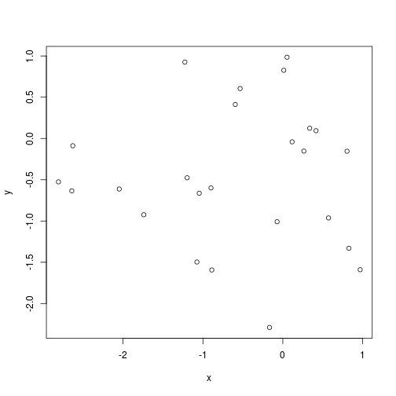

## Read-And-Delete

1. Edit YAML front matter
2. Write using R Markdown
3. Use an empty line followed by three dashes to separate slides!

--- .class #id 

## Slide 2

Presentación 2

Prueba 

$$ x^2 + 5 $$


---


### Slide 3


```r
sum(1:10)
```

```
## [1] 55
```

```r
10*(11)/2
```

```
## [1] 55
```

---


### Slide 4


```r
x <- rnorm(25)
y <- rnorm(25)

plot(x, y )
```



---
